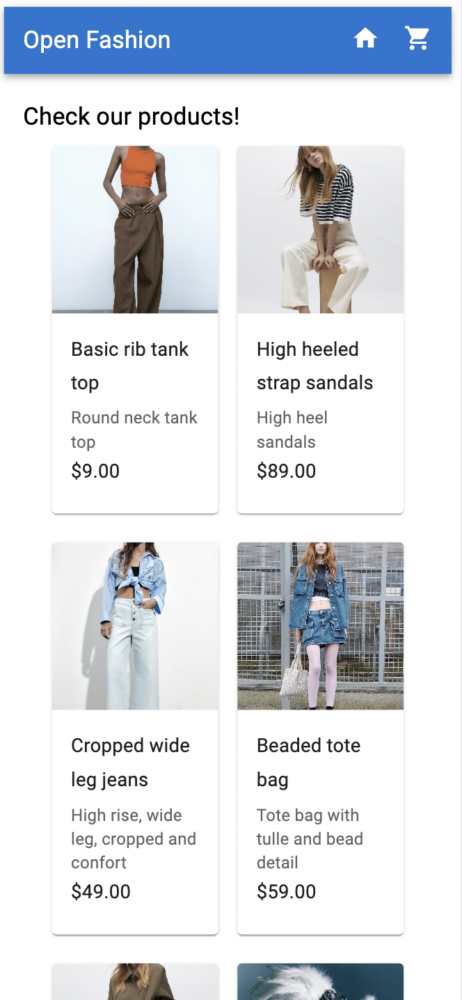
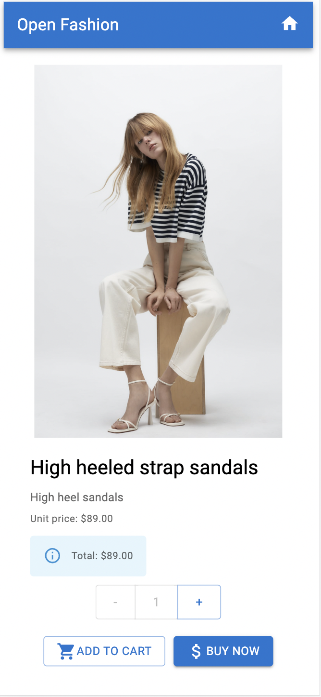
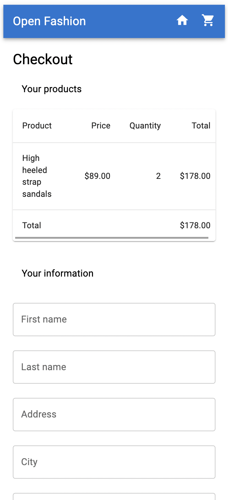
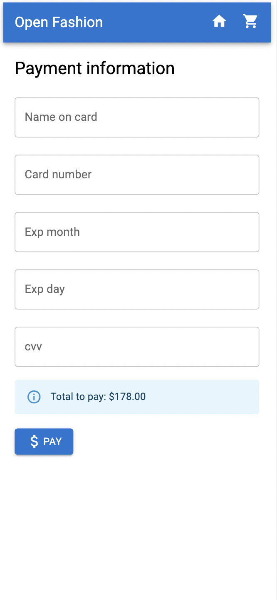
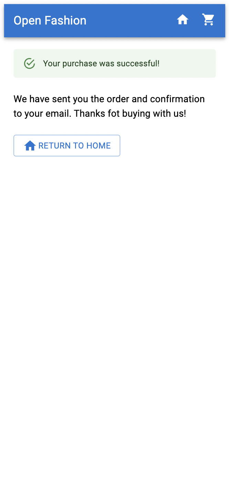

# Ecommerce frontend demo app 🚀

This is a demo projet I developed as part of my personal portfolio.
This is an ecommerce demo containing:

1. Catalog page: displaying a list of products on sale
2. Product detail page: displaying the information about that specific project. It also allows you to select how many products you want.
3. Cart checkout page: displaying the total products you have in your cart. It also has a form for client information.
4. Payment method page: with a form about the payment method.
5. Purchase confirmation page: displaying information about payment confirmation

As this is a demo app, it does not contain all the expected functionallities an ecommerce app should have.

## Full-stack project

This is part of a full-stack project, so this frontend app is connected to a backend app developed as part of personal portfolio too. So if you want to run this app locally, you should run the backend at the same time.

> [Backend project with Express](https://github.com/leoBravoRain/ecommerce-backend)

> [Backend project with Nest Js](https://github.com/leoBravoRain/ecommerce-backend-nest-js)

## Requisites 🔌

- **Node Versión**: v18.14.0
- **NPM Versión**: 9.3.1

_Remember_: This app is connected to other backend app, so if you want to run locally, you should run this backend app too.

## Setup 🚀

**Environment variables**

- Create .env file at the root directory (same as README.me) with the following variables: `REACT_APP_API_URL`, `PORT`.
  If you want to run locally, I recommend set `REACT_APP_API_URL` as `http://192.168.1.86:3000/` (this is the backend developed for this app), and `PORT` as `3001`

**Run locally**

- _Install dependencies_: `run npm install`
- _Run locally_: `npm run start`

## Highlitghts about the technology used in this project 📋

- To store a global state that keep track of cart items and client information, it has implemented REDUX, using [Redux Toolkit](https://redux-toolkit.js.org/introduction/getting-started).
- It contains requests to a backend app, using _get_ and _post_ operations. For this, it uses Axios instance and [React-query](https://react-query-v3.tanstack.com/overview). React-query allows you to to manage requests easily, by providing custom hooks and performant mechanisms to fetch data, refetch, cache and manage its state.
- To add style to components, it uses [Material UI](https://mui.com/material-ui/getting-started/overview/).
- To static data type validation at compile time, it uses Typescript.
- To runtime data type validation, it uses [Zod](https://zod.dev/?id=introduction), mainly focused on data returned from backend responses.
- To build and manage form state (on client and payment method pages), it uses [useForm](https://react-hook-form.com/api/useform). It helps to manage forms easily, by providing hooks that allows you to access and set form values, validations, displaying errors, subtmitting.

## Project demo images

Desktop version:

Index page:

To click on any product:

When click on buy now:

When click on next in the previous page:

When confirm payment and create a purchase order:

Mobile:

    
Index page: 

    

    
To click on any product:

    

    
When click on buy now:

    

    
When click on next in the previous page:

    

    
When confirm payment and create a purchase order:

    

